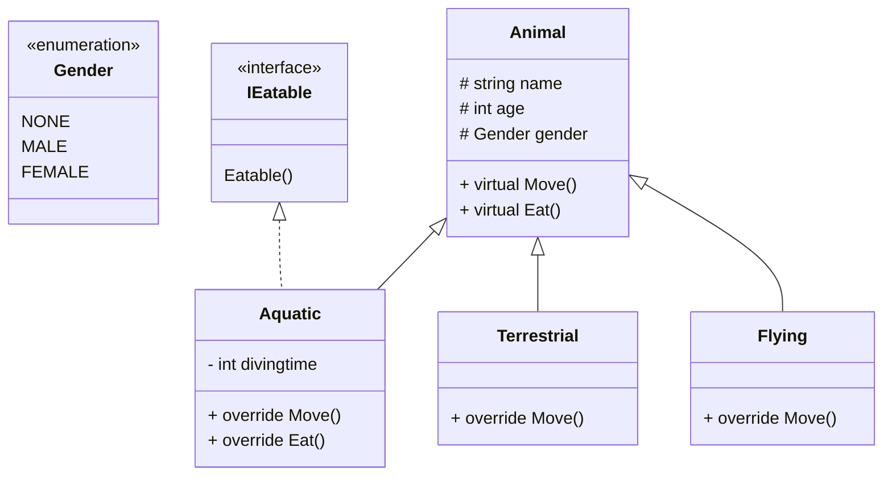
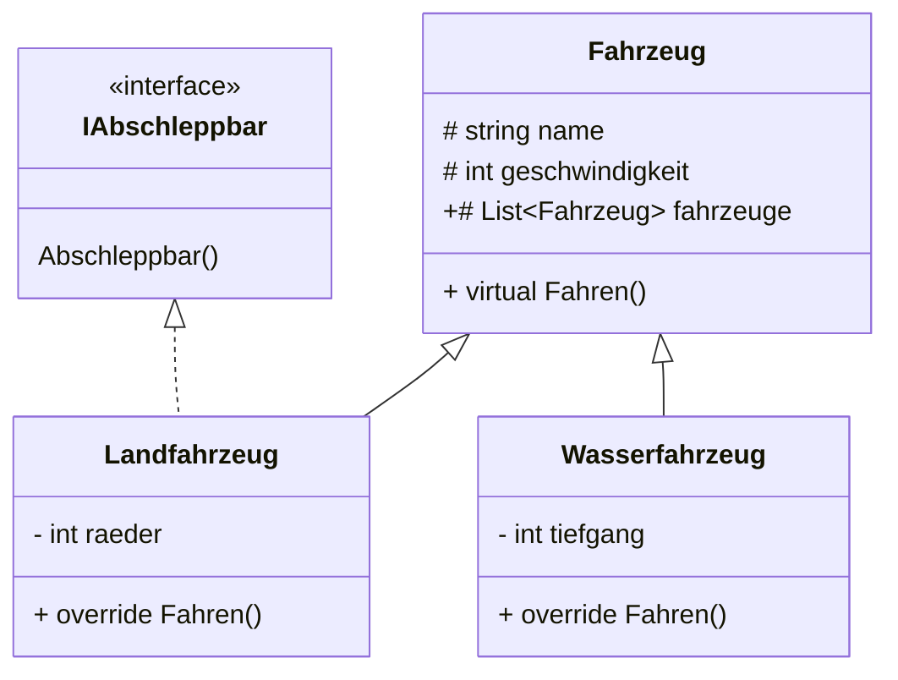
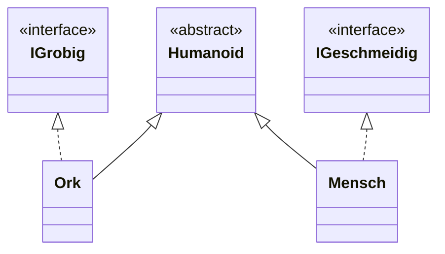
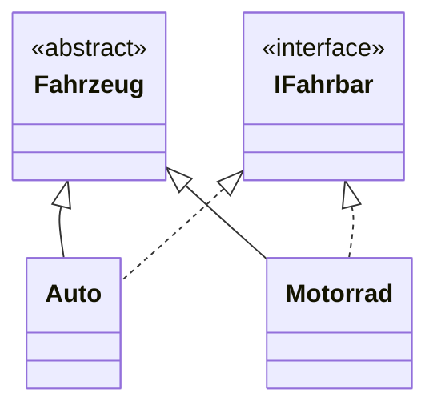

# C# Advanced Course - Console

## 04.09 Wiederholung 

- Verschachtelung von Verweisdatentypen
- Standard- & Parameterkonstruktor
- Zugriffsmodifikator `public`
- statische `Run()`-Methode

## 04.11 typisierte Liste von Objekten

- Erstellen Sie einen Computer
  - mit Getter / Setter
  - einer typisierten Liste von Verweisdatentypen
  - mit geeigneten Methoden für `Hauptmenu()` und `ComputerErstellen()`

## 04.12 Game

Erstellen Sie ein Spiel, bei dem ein Spieler gegen einen Computer antritt.
Spieler und Computer sollen über 2 Angriffsmethoden verfügen.


## 04.15 Game - konzeptionelle Vorgehensweise

Vermeidung von redundantem Code, bei Auswahl aus unterschiedelichen Klassen durch
eine allgemeine Implementierung für alle Characterklassen

➡️Deklarierung eines Objektnames und Zuweisung des jeweiligen Constructors
  nach Auswahl der Charakterklasse

- Vererbung
- virtuelle Methoden, mit der Möglichkeit überschrieben werden zu können
- Benutzung Base-Constructor

## 04.16 

- Vererbung
- Interface
- virtual / override

### Animal

- Enumeration



### Fahrzeug

- typisierte Liste `List<Fahrzeug>`
  - Automatische Registrierung von Objekten über Constructor
  - Iterieren über die Liste `List<Fahrzeug>`



## 04.17 SQL

- Installation `MySqlConnector` über `NuGet`-Paketmanager
- Verwendung von SQL-Statements
  - INSERT INTO
  - UPDATE
- Ausgabe in der `Console`
- Datenbank: `onlineshop.sql`


> Run: Program.cs
> ```csharp 
> public static void Main(string[] args){}
> ```

## 04.24 Exceptions und Abfangen über `try-catch`

- Unterschiedliche Exception und deren Diagnose
- Erstellen eigener Exception

## Aufgaben

### Inheritance

Schreiben Sie für alle Humanoide eine Klasse in C#. Jeder Humanoid sollte über das Attribut `name` verfügen. 

Zusätzlich soll für alle Humanoide, die Orks sind, die Eigenschaft/ Property `GROBIG` implementiert werden.

Für alle Menschen, soll die Eigenschaft/ Property `GESCHMEIDIG` implementiert werden.

Eine Methode `Steckbrief()` soll die Daten auf den Bildschirm schreiben.

Weitere Kriterien für die Umsetzung:
- Setzen Sie die Vererbung und abstrakte Basisklassen sinnvoll ein.
- Nutzen Sie die Möglichkeiten der Interfaces, um bestimmte Implementierungen vorzugeben.
- Die Steckbrief-Methode soll den Polymorphismus ausnutzen, damit eine beliebige Child-lnstanz einem 
Basisklassenverweis zugewiesen werden kann. Das bedeudet jeder Steckbrief gibt etwas anderes aus.
- Orientieren Sie sich bei der Umsetzung an dem folgenden UML-Klassendiagramm.




### Inheritance2

Erstellen Sie ein Programm in C#, das eine Hierarchie von Fahrzeugen modelliert. Die Fahrzeuge können verschiedene 
Typen sein, wie Autos, Motorräder usw. Jedes Fahrzeug sollte mindestens folgende Attribute haben: 
- Marke
- Modell
- Höchstgeschwindigkeit.

Verwenden Sie dafür ein abstraktes Klasse (Fahrzeug) und ein Interface (IFahrbar). Das Interface sollte eine Methode 
`Fahren()` enthalten, die die Aktion des Fahrens repräsentiert. Die abstrakte Klasse sollte die allgemeinen
Eigenschaften und Methoden der Fahrzeuge enthalten, sie besitzt auch das Interface, dass die spezifische Aktion
des Fahrens definiert. Die Abstrakte Klasse besitzt die abstrakte Methode `FahrzeugInfo()` welche in den konkreten
Klassen dann `Marke`, `Modell` und `Höchstgeschwindigkeit` per Console ausgibt.

Erstellen Sie dann mindestens zwei konkrete Klassen `Auto` und `Motorrad`, die von der abstrakten Klasse erben und
das Interface implementieren. Implementiere die `Fahren()`-Methode und `Fahrzeuglnfo()`-Methode für jedes Fahrzeug 
entsprechend. 

Schließlich, in eines Programms (Klasse `Program`), erstellen Sie Objekte für jedes Fahrzeug
und rufen die `Fahren()`-Methode auf und geben zusätzlich die Informationen über jedes Fahrzeug aus.

Namespaces werden nicht erwartet. Freie Wahl ob Getter/Setter oder Properties.




### Mathe

Für den Mathematikunterricht einer Berufsschule soll eine Klasse 
entwickelt werden, die einige nützliche statitsche Methoden zur Verfügung stellt.
Implementieren Sie dazu die folgenden statischen Methoden in einer Klasse `Mathematik`:

- Addieren
- Subtrahieren
- Potenz-Methode
- Fakultät-Methode

Es wird nur eine Klasse erwartet.

### Taschenrechner

Simulieren Sie die Funktion eines Taschenrechners mit zwei Operanden für die vier
Grundrechenarten und Modulo. Es wird kein User Input verlangt.

- Speichern Sie die Wahl der Rechenart sowie die Werte der beiden zu verrechnenden 
Operanden in entsprechenden Variabln
- Verwenden Sie eine `switch-case` um den Operator auszuwerten
- Lassen Sie testweise 57 % 3 rechnen und geben Sie das Ergebnis aus

### Zinseszinsrechner

Es ist das Endkapital einer Spareinlage zu berechnen.

Dazu sollen das Startkapital und der Zinssatz über die Tastatur eingegeben werden. 

Die Anlage läuft immer drei Jahre. Beachten Sie den Zinseszinseffekt. 

Anschließend soll das Endkapital ausgegeben werden.

Wählen Sie für die Variablen geeignete Datentypen.

> Beispiel:
> - Startkapitel: 1000 (Euro)
> - Zinssatz: 5 (Prozent)
> - Endkapital: 1157.625 (Euro nach drei Jahren)

### MySQL
Sie haben von einem Mitarbeiter ein C# Skript bekommen, das mit einer Datenbank kommunizieren soll. Dieses
Skript greift auf die Tabelle Kunden zu, die die folgenden Spalten enthält: `id`, `vorname`, `nachname` .

Schreiben Sie die `Lesen()` Methode um die Tabelle in der Konsole auszugeben.
Verwenden Sie hierfür auf jedenfall ein `Try-Catch`.

```csharp
    private static string connectionString =
      "Server=127.0.0.1; Database=onlineshop;User=root;Password=;";

    private static MySqlConnection connection;

    public static void Verbinden()
    {
      try
      {
        connection = new MySqlConnection(connectionString);
        connection.Open();
      }
      catch (Exception e)
      {
        Console.WriteLine(e);
        throw;
      }
```
